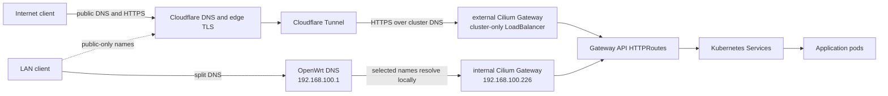

# Networking

<!-- markdownlint-configure-file {"MD013": {"tables": false}} -->

This document describes how traffic enters and leaves the homelab Kubernetes
cluster. It is the operational map for the LAN, cluster networking, DNS, TLS,
and public ingress. For publishing static sites from VersityGW, see
[Website hosting](./WEBSITE_HOSTING.md).

## Topology



There is no inbound port-forward from the internet to the LAN. Public traffic
enters through outbound `cloudflared` connections.

## Address inventory

| Purpose | Address or range | Source of truth |
| --- | --- | --- |
| LAN router and DNS | `192.168.100.1` | CoreDNS and OpenWrt configuration |
| Kubernetes nodes | `192.168.100.103-108` | Ansible inventory |
| Kubernetes API virtual IP | `192.168.100.100` | `KUBE_VIP_ADDR` / kube-vip configuration |
| Cilium LoadBalancer pool | `192.168.100.220-230` | `CiliumLoadBalancerIPPool` |
| Internal HTTPS Gateway | `192.168.100.226` | `GATEWAY_INTERNAL_ADDR` |
| Pod network | `10.42.0.0/16` | k3s and Cilium configuration |
| Service network | `10.43.0.0/16` | k3s configuration |
| Cluster DNS Service | `10.43.0.10` | CoreDNS Helm values |

The node addresses indicate a `192.168.100.x` LAN, but the router's subnet
mask is not managed in this repository. Check OpenWrt before treating `/24` as
authoritative.

Other addresses inside the Cilium pool are reserved in
`kubernetes/flux/vars/cluster-settings.yaml` for services such as MQTT,
Jellyfin, Alloy, and Syncthing. Allocate new LoadBalancer addresses from the
pool only after checking that file.

## Cluster networking

k3s runs without Flannel, kube-proxy, ServiceLB, Traefik, or its bundled
CoreDNS. Their relevant responsibilities are provided by Cilium and the
separately installed CoreDNS release.

Cilium is configured with:

- Native routing for the `10.42.0.0/16` pod network.
- Kubernetes IPAM and kube-proxy replacement.
- Direct node routes and DSR load-balancing.
- Gateway API through Cilium Envoy.
- LoadBalancer IPAM and L2 announcements on the LAN.

kube-vip advertises only the highly available Kubernetes API address,
`192.168.100.100`. Cilium allocates and advertises application LoadBalancer
addresses.

Two L2 announcement policies are deliberate:

- Non-Gateway LoadBalancer Services and the `internal` Gateway are announced
  on the LAN.
- The `external` Gateway is excluded from L2 announcements. Its allocated
  LoadBalancer address is not a supported LAN entry point because
  `cloudflared` reaches it through
  `cilium-gateway-external.networking.svc.cluster.local`.

## DNS

### Cluster DNS

Pods use CoreDNS at `10.43.0.10`. CoreDNS is authoritative for Kubernetes
service discovery under `cluster.local` and forwards non-cluster queries using
the node resolver and the OpenWrt resolver at `192.168.100.1`.

### Internal DNS

OpenWrt dnsmasq implements split DNS. The Ansible router playbook installs:

- A wildcard-style address override for `${SECRET_DOMAIN}` to
  `192.168.100.226`.
- `home.lan` to `192.168.100.226`, where the Gateway redirects it to the
  homepage.
- Selected names below `thiagoalmeida.xyz` to `192.168.100.226` so LAN users
  do not hairpin through Cloudflare.

The current selected public names are `analytics`, `arai`, `drive`, `media`,
`photos`, `portfolio`, `share`, `notes`, and `readeck`. This list is maintained
as `public_lan_subdomains` in `ansible/playbooks/openwrt-router.yml`.

Names that are not in split DNS—including public Versity website names—resolve
normally and use Cloudflare even when requested from the LAN.

### Public DNS

ExternalDNS watches `HTTPRoute` objects attached to the `external` Gateway and
the `DNSEndpoint` CRD. It is restricted to `thiagoalmeida.xyz`, uses a `sync`
policy, and creates proxied Cloudflare records.

The public chain is logically:

```text
application.thiagoalmeida.xyz
  -> ingress.thiagoalmeida.xyz
  -> <tunnel-id>.cfargotunnel.com
```

Cloudflare proxying normally hides this CNAME chain from public DNS responses.
The first mapping is produced from an external `HTTPRoute` and the Gateway's
ExternalDNS target annotation. The second is declared by the `cloudflared`
`DNSEndpoint`.

Do not manually create records for normal external HTTPRoutes. ExternalDNS has
`policy: sync`, so records within its ownership scope that are removed from
Kubernetes are also removed from Cloudflare.

## Gateways and routes

Both Gateways live in the `networking` namespace and use `gatewayClassName:
cilium`.

| Gateway | Entry point | Intended routes |
| --- | --- | --- |
| `internal` | LAN address `192.168.100.226` | Private applications and selected split-DNS public names |
| `external` | Cloudflare Tunnel through the cluster Service | Explicitly public applications |

HTTP listeners redirect to HTTPS. The external HTTPS listener accepts hosts
under `*.thiagoalmeida.xyz`. Versity websites use exact first-level public
hostnames on this listener and rewrite the upstream hostname to Versity's
native `bucket.sites.thiagoalmeida.xyz` mapping.

An HTTPRoute is public only when it references the `external` Gateway. Merely
creating a Service, using a public-looking hostname, or attaching to the
`internal` Gateway does not expose an application through the tunnel.

The `error-pages` HTTPRoute owns unmatched ordinary public and private
hostnames. Exact HTTPRoute hostnames are more specific and take precedence.

## Public request path

1. ExternalDNS creates a proxied Cloudflare record for the HTTPRoute hostname.
2. The client establishes TLS with the Cloudflare edge.
3. Cloudflare forwards the request over the named Tunnel to one of two
   `cloudflared` replicas in the cluster.
4. The tunnel ingress wildcard sends the request to the external Cilium Gateway
   over HTTPS. Its `originServerName` is `ingress.thiagoalmeida.xyz`.
5. Cilium Envoy terminates origin TLS, selects the HTTPRoute from the original
   request hostname, and forwards the request to its Kubernetes Service.
6. The Service selects the application pod.

Versity's deeper `bucket.sites.thiagoalmeida.xyz` names are used only as
rewritten upstream hostnames. Visitors use exact first-level public names so
Cloudflare can terminate edge TLS with Universal SSL.

## TLS boundaries

Public requests have two independent TLS connections:

| Connection | Certificate owner | Required coverage |
| --- | --- | --- |
| Visitor to Cloudflare | Cloudflare edge certificate | The visitor-facing application hostname |
| `cloudflared` to Cilium Gateway | cert-manager / Let's Encrypt | The configured origin SNI and Gateway listener hostnames |

The cert-manager Certificate covers `thiagoalmeida.xyz`,
`*.thiagoalmeida.xyz`, and `*.${SECRET_DOMAIN}`. It uses DNS-01 validation
through Cloudflare, so issuance does not require an inbound LAN connection.

Cloudflare Universal SSL on a full zone covers the apex and one subdomain
level, but not names such as `bucket.sites.thiagoalmeida.xyz`. See
[Website hosting](./WEBSITE_HOSTING.md) for the first-level public hostname
design used to avoid that limitation.

## Configuration sources

| Concern | Repository path |
| --- | --- |
| Flux substitutions and LAN service addresses | `kubernetes/flux/vars/cluster-settings.yaml` |
| Public and private domain substitutions | `kubernetes/flux/vars/cluster-secrets.sops.yaml` |
| Node inventory | `ansible/inventory/hosts.yml` |
| Pod and Service CIDRs | `ansible/inventory/group_vars/master/k3s.yml` |
| kube-vip address | `ansible/inventory/group_vars/kubernetes/kube-vip.yml` |
| Cilium routing and Gateway support | `kubernetes/apps/kube-system/cilium/app/helm-values.yaml` |
| LoadBalancer pool and L2 policies | `kubernetes/apps/kube-system/cilium/config/cilium-l2.yaml` |
| Internal and external Gateway listeners | `kubernetes/apps/networking/cilium-gateway/app/gateway.yaml` |
| Public DNS controller | `kubernetes/apps/networking/external-dns/app/helmrelease.yaml` |
| Tunnel DNS and ingress | `kubernetes/apps/networking/cloudflared/app/` |
| Origin certificates | `kubernetes/apps/networking/certificates/app/` |
| OpenWrt split DNS | `ansible/playbooks/openwrt-router.yml` |

Flux substitutes the `cluster-settings` ConfigMap and `cluster-secrets` Secret
into application manifests. `${PUBLIC_DOMAIN}`, `${SECRET_DOMAIN}`, and address
variables in Git are therefore templates, not shell variables that must be set
inside application pods.

## Troubleshooting

Start at the client-facing boundary and work toward the pod.

### DNS checks

```sh
dig application.thiagoalmeida.xyz
dig @192.168.100.1 application.thiagoalmeida.xyz
kubectl -n networking logs deploy/external-dns --since=15m
```

For a split-DNS name, the router query should return `192.168.100.226`. A
public-only name should return Cloudflare addresses.

### Edge and origin TLS

```sh
openssl s_client \
  -connect application.thiagoalmeida.xyz:443 \
  -servername application.thiagoalmeida.xyz </dev/null

kubectl -n networking get certificates,certificaterequests
kubectl -n networking describe certificate
```

The certificate shown by `openssl` is Cloudflare's edge certificate, not the
cert-manager origin certificate.

### Tunnel

```sh
kubectl -n networking get pods -l app.kubernetes.io/name=cloudflared
kubectl -n networking logs deploy/cloudflared --since=15m
kubectl -n networking get dnsendpoint cloudflared -o yaml
```

### Gateway API

```sh
kubectl -n networking get gateway external internal
kubectl get httproute -A
kubectl -n <route-namespace> describe httproute <route-name>
```

The relevant route parent should report `Accepted=True` and
`ResolvedRefs=True`. If it does not, check the listener name, hostname
intersection, backend Service name, port, and namespace.

### Service and pod

```sh
kubectl -n <namespace> get service <service> -o wide
kubectl -n <namespace> get endpointslice \
  -l kubernetes.io/service-name=<service>
kubectl -n <namespace> logs deploy/<application> --since=15m
```

An accepted HTTPRoute can still return `503` when its Service has no ready
endpoints.

## External references

- [Cilium Gateway API](https://docs.cilium.io/en/stable/network/servicemesh/gateway-api/gateway-api/)
- [ExternalDNS Gateway API source](https://github.com/kubernetes-sigs/external-dns/blob/master/docs/sources/gateway-api.md)
- [Cloudflare Tunnel ingress configuration](https://developers.cloudflare.com/tunnel/advanced/local-management/configuration-file/)
- [Cloudflare Universal SSL limitations](https://developers.cloudflare.com/ssl/edge-certificates/universal-ssl/limitations/)
